# Proyecto-Final-Precurso


# gamezonex - Tienda de Videojuegos Drag&Drop

Este es el último proyecto del pre-curso GeekHubs.  A continuación, se describen las principales características del proyecto:

## Página Principal

- La página principal cuenta con una cabecera fija que actua como menú y permite navegar por las diferentes secciones del proyecto.

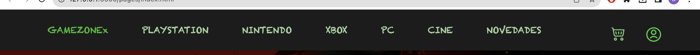

- Incluye un video promocional de un lanzamiento de videojuego.

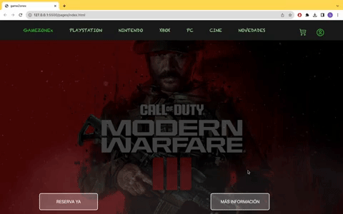

- Un carrusel dinámico muestra las diferentes categorías de videojuegos disponibles, y al hacer clic en una categoría, te lleva a la página correspondiente.

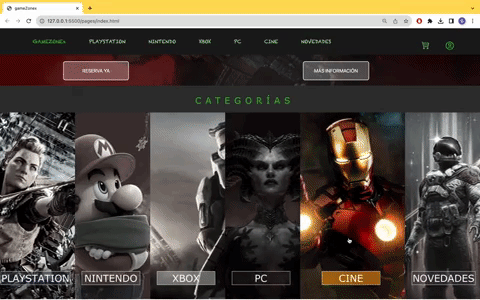

- Secciones adicionales como "Trabaja con nosotros," "Sobre nosotros," y "Preguntas Frecuentes (FAQ)" proporcionan información adicional sobre el proyecto.

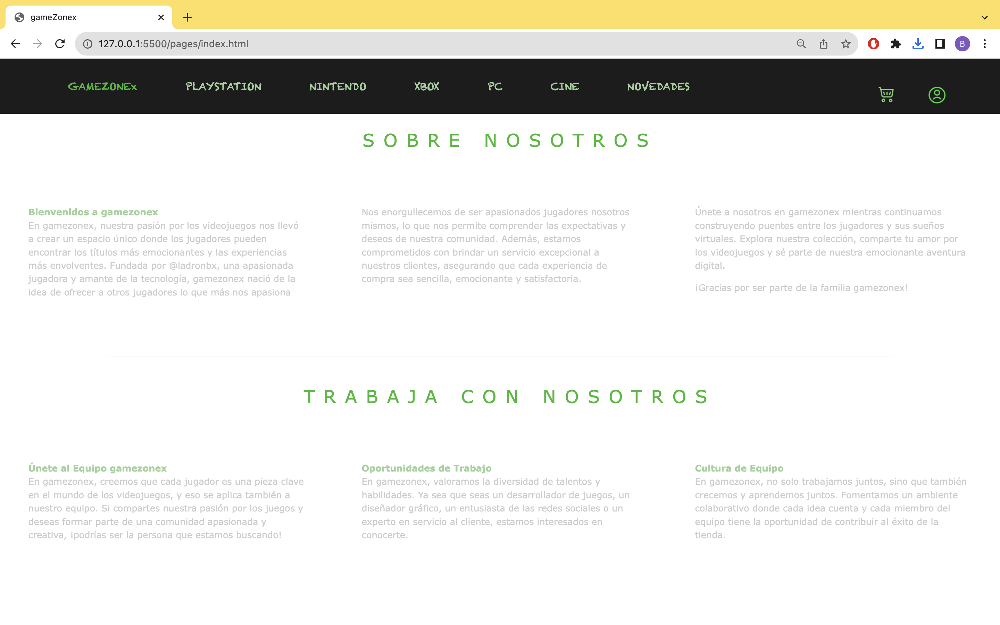
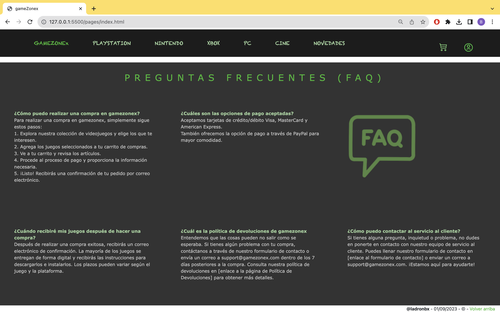
## Barra de Navegación

- Al hacer clic sobre el ícono de usuario, se accede a una página ficticia de inicio de sesión.


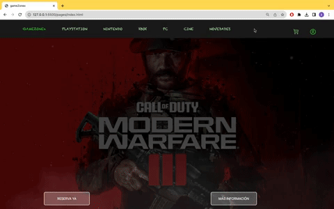


- En el interior de esta página, los usuarios no registrados pueden registrarse haciendo clic en el enlace "Regístrate aquí."


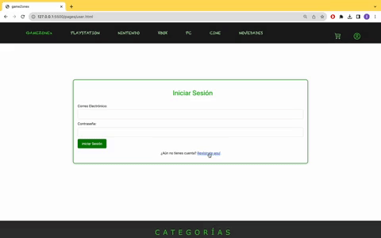

## Registro de Usuarios

- La página de registro de usuarios contiene un formulario donde los usuarios pueden ingresar sus datos.

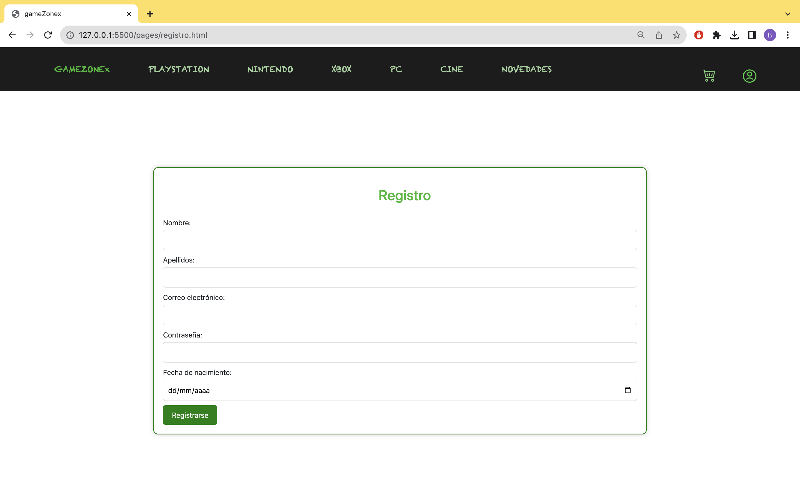


## Páginas de Categorías

- Hay cinco categorías principales: PlayStation, Nintendo, Xbox, PC y Cine.
- En estas páginas, los usuarios pueden comprar productos haciendo clic en ellos o arrastrándolos y soltándolos.
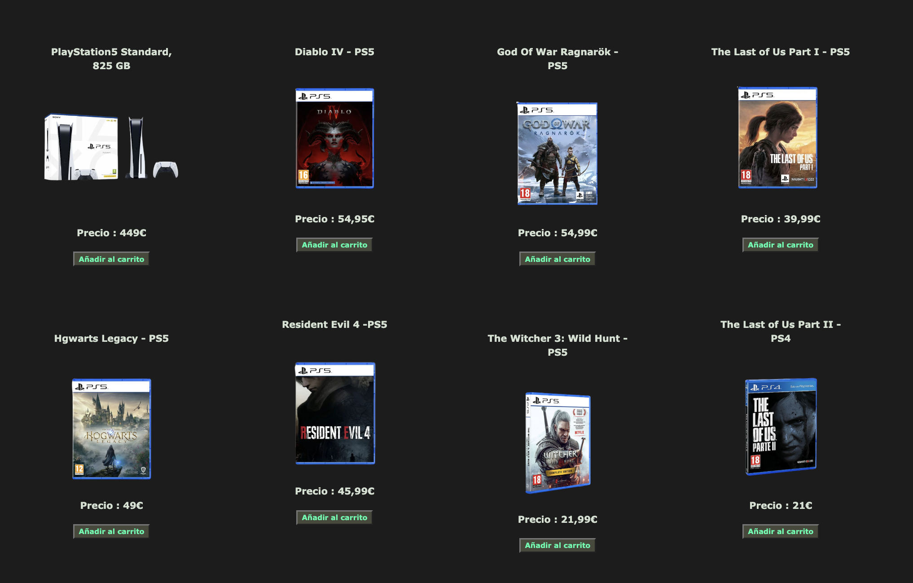
- Una cesta en el lateral de la página muestra los productos seleccionados y su precio actualizado. También incluye botones para "Eliminar todo" y "Realizar pedido."
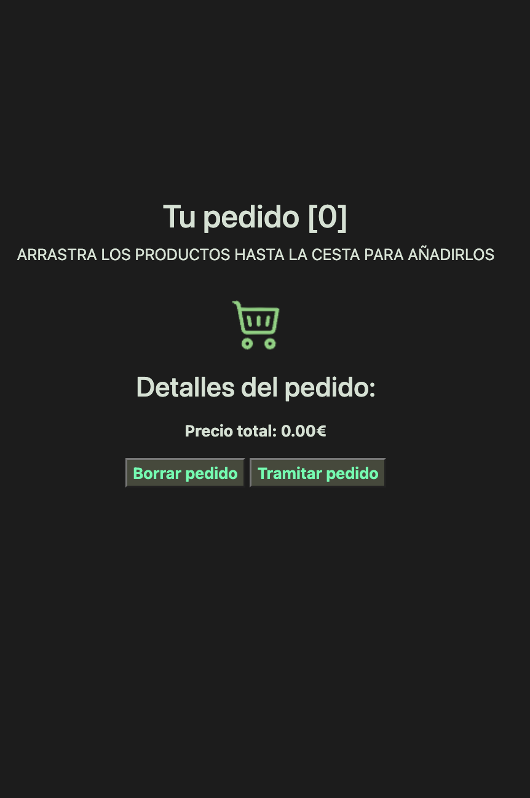

## Sección de Novedades

- Esta sección presenta noticias sobre las fechas de lanzamiento de videojuegos, incluyendo un video del tráiler.
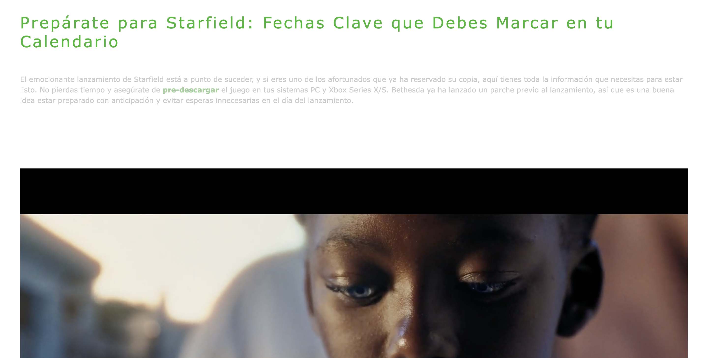
- También incluye una noticias relacionadas con videojuegos.
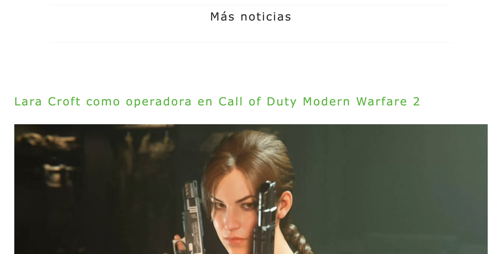

## Código Fuente

El código fuente de gameZonex está organizado en diferentes páginas HTML, archivos JavaScript y hojas de estilo CSS. A continuación, se enumeran las páginas principales y los archivos asociados:

- `index.html`: Página principal de gameZonex con la cabecera, video promocional y carrusel de categorías.
- `nintendo.html`: Página dedicada a productos de Nintendo.
- `pc.html`: Página dedicada a productos de PC.
- `playstation.html`: Página dedicada a productos de PlayStation.
- `xbox.html`: Página dedicada a productos de Xbox.
- `cine.html`: Página dedicada a productos de cine.
- `novedades.html`: Página que muestra las últimas novedades en videojuegos y entretenimiento.
- `user.html`: Página de usuario donde se puede simular un inicio de sesión y registro.
- `registro.html`: Página de registro de usuario.
- `cesta.html`: Página de la cesta de compras con funcionalidad de arrastrar y soltar productos.
- `img-video/`: Directorio que contiene imágenes y videos utilizados en el sitio.
- `script-drag.js`: Archivo JavaScript que maneja la funcionalidad de arrastrar y soltar productos en la cesta.
- `script-enlaces-carrusel.js`: Archivo JavaScript para la navegación en el carrusel de categorías.
- `style-carrusel.css`: Hoja de estilo CSS para el carrusel de categorías.
- `style-novedades.css`: Hoja de estilo CSS para la página de novedades.
- `style-productos.css`: Hoja de estilo CSS para la presentación de productos.
- `style-video-call.css`: Hoja de estilo CSS para la página de video promocional.
- `styleIndex.css`: Hoja de estilo CSS para la página principal.
- `README.md`: Este archivo de documentación.


## Instrucciones de Descarga

Para obtener una copia de este proyecto en tu PC, puedes seguir estos pasos:

1. Abre tu terminal o línea de comandos.

2. Utiliza el siguiente comando para clonar el repositorio en tu máquina:

   ```bash
   git clone https://github.com/ladronbx/Proyecto-Final-Precurso.git


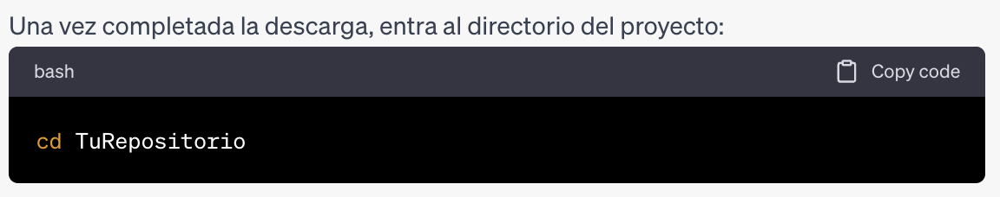

## Instrucciones de Visualización

Para ver la página web en tu PC, sigue estos pasos:

1. Abre el proyecto en tu editor de código preferido.

2. Encuentra el archivo `index.html` en la raíz del proyecto y ábrelo en tu navegador web.

3. Ahora podrás navegar por la página web gameZonex y explorar todas sus características.


## Contribuciones

Este proyecto es obra de @ladronbx. Si deseas contribuir, ¡siéntete libre de hacerlo! Envía tus contribuciones a través de pull requests.

---

## Contacto

Si tienes alguna pregunta o sugerencia, no dudes en ponerte en contacto conmigo a través de [ladronbravovlc@gmail.com](mailto:ladronbravovlc@gmail.com).

---
